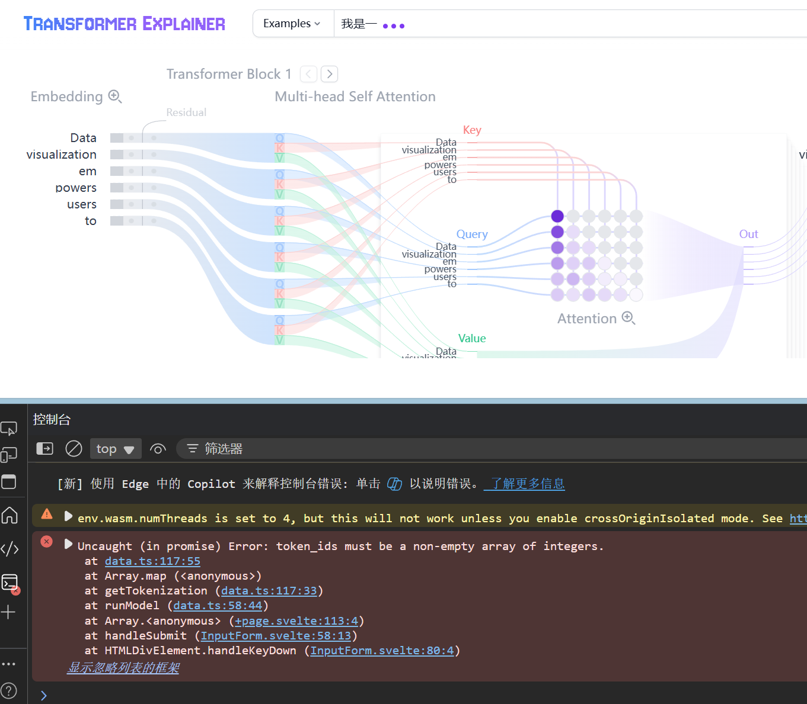

# 输入中文token会出现这样的问题


[data.ts](../src/utils/data.ts)中
```js
export const getTokenization = async (tokenizer: PreTrainedTokenizer, input: string) => {
	const token_ids = tokenizer.encode(input);
	const input_tokens = token_ids.map((id) => tokenizer.decode([id])).flat();

	return {
		token_ids,
		input_tokens
	};
};
```